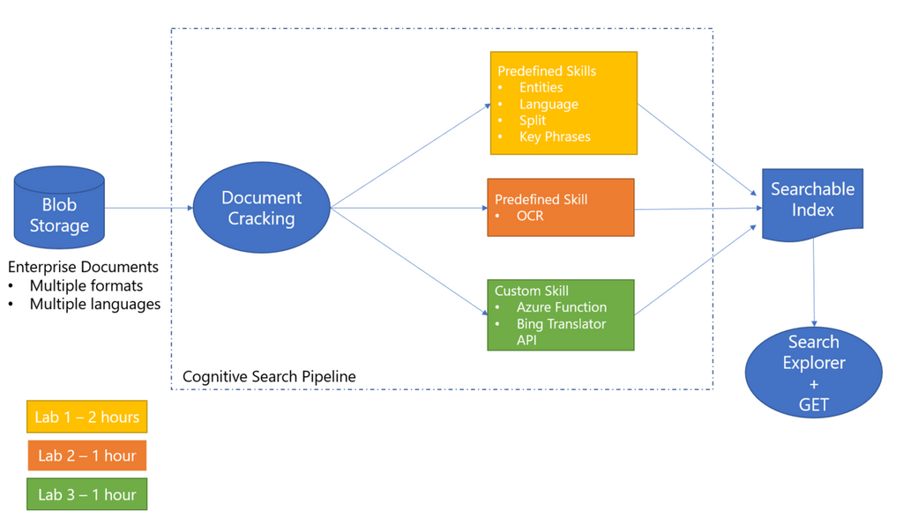

# Agency Innovation Day London 2018 Hackfest - For the builders of the group !!!
The morning 3 hours hackfest is split into 3 tracks:
1. Gain Insight Into Assets with AI
2. Build a Modern Application on containers with CI/CD
3. Build a Bots with zero code

Choose the track you are most interested in. But don't worry, these are all publicly accessible so you can run through them at your own time.

## Pre-requisites
1. A computer/laptop
2. An Azure subscription. If you do not have an Azure subscription you can create one for free at https://azure.microsoft.com/en-gb/free/
3. For track 2, you will need to install Azure CLI and kubectl to complete the lab :
- [Install kubectl](https://kubernetes.io/docs/tasks/tools/install-kubectl/) 
- [Install Azure CLI](https://docs.microsoft.com/en-us/cli/azure/install-azure-cli?view=azure-cli-latest)

## 1. Gain Insight Into Assets with AI

Building an Enterprise Cognitive Search Solution:

Start here: https://github.com/farishaddad/Knowledge-Mining-using-Cognitive-Search/blob/master/readme.md

Note: for Lab 3, create a Virtual Machine with Visual Studio 2017 community edition already installed. Follow these [instructions in Task 1, 2 and 3](https://github.com/Microsoft/MCW-App-modernization/blob/master/Hands-on%20lab/Before%20the%20HOL%20-%20App%20modernization.md)

## 2. Build a Modern Application on containers with CI/CD

An introduction to the principles of DevOps and containerisation using Azure DevOps (previously VSTS) and the Azure Kubernetes Service.

This is what you will be building:

Start here: https://github.com/VRouetAtMS/DevOps-and-Containers/blob/master/README.md

## 3. Build a Bots with zero code
